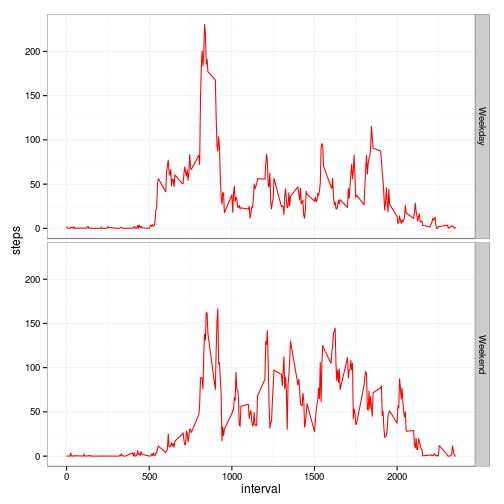

# Reproducible Research: Peer Assessment 1
====================================================
***
### Submitted by: Hitesh Tulsani

***


## 1. Loading and preprocessing the data


```r
# download the activity.zip file unzip it
        if(!file.exists("activity.zip") & !file.exists("activity.csv")) {
                fileurl <- "https://d396qusza40orc.cloudfront.net/repdata%2Fdata%2Factivity.zip"
                zipfile <- "activity.zip"
                download.file(fileurl,destfile=zipfile, method="curl")
                unzip(zipfile)
        } else if(file.exists("activity.zip")) {
                unzip("activity.zip")
        }

# read the activity file into activity variable in R
        activity <- read.csv("activity.csv",colClasses=c("integer","Date","integer"))
```

## 2. What is mean total number of steps taken per day?

Calculate the total number of steps taken per day using melt and dcast from 
reshape2 package as follows:


```r
        library(reshape2)
        melted <- melt(activity, id.vars=c("date","interval"))
        sumofsteps <- dcast(melted, date~variable, fun.aggregate=sum, na.rm=TRUE)
```

Next, plot the histogram of total number of the steps taken per day.


```r
        hist(sumofsteps$steps, xlab="Total number of steps per day", main="", breaks=15)
```

 

The mean total number of steps taken per day is **9354.2295**.

The median total number of steps taken per day is **10395**.

## 3. What is the average daily activity pattern?

To answer this question, calculate average number of steps for each interval across all the days as follows:

```r
        meanofsteps <- dcast(melted, interval~variable, fun.aggregate=mean, na.rm=TRUE)
```

The plot of the 5-minute interval and average number of steps taken, averaged across all days is as follows:


```r
plot(steps~interval, data=meanofsteps, xlab="Interval", ylab="Avg Steps", type="l")
```

 

The interval which contains maximum number of steps is


```r
        meanofsteps[which(meanofsteps$steps==max(meanofsteps$steps)),1]
```

```
## [1] 835
```

## 4. Imputing missing values

The total number of missing values in dataset is


```r
        NAindex <- is.na(activity$steps)
        sum(NAindex)
```

```
## [1] 2304
```

Replace missing values by 5-minute interval, combine and store dataset into new one called *newactivity*


```r
        newactivity <- activity
        missing <- newactivity$interval[NAindex]
        filled <- numeric()
        for(id in 1:nrow(meanofsteps)){
          filled[missing %in% meanofsteps$interval[id]] <- meanofsteps$steps[id]
        }
        newactivity$steps[NAindex] <- filled
```

In order to compare the new dataset with the original dataset, let's look the histogram of the total number of steps taken each day based on the new dataset.


```r
        newmelt <- melt(newactivity, id.var=c("date","interval"))
        newstepsum <- dcast(newmelt, date~variable, fun.aggregate=sum)
        hist(newstepsum$steps, xlab="Total number of steps per day", main="Histogram based on new dataset", breaks=10)
```

 

The mean total number of steps taken per day in the new dataset is **1.0766 &times; 10<sup>4</sup>**.

The median total number of steps taken per day in the new dataset is **1.0766 &times; 10<sup>4</sup>**.

As we can see, the mean and median total number of steps taken per day are both greater than that in the original dataset.

## 5. Are there differences in activity patterns between weekdays and weekends?

First, we need to create a new variable indicating whether a given date is a weekday or weekend day.


```r
# set aspects of the locale to return the weekday names in english
        Sys.setlocale("LC_TIME","English United States")
```

```
## Warning: OS reports request to set locale to "English United States"
## cannot be honored
```

```
## [1] ""
```

```r
        day <- weekdays(newactivity$date)
        newactivity$days <- ifelse(day %in% c("Saturday", "Sunday"), "Weekend","Weekday")
```

The plot of 5-minute interval and average number of steps taken, averaged across weekdays / weekends is as follows:

```r
        library(ggplot2)
        newmeltmean <- melt(newactivity, measure.vars="steps")
        newmeanofsteps <- dcast(newmeltmean, days+interval~variable, fun.aggregate=mean)
        g<-ggplot(newmeanofsteps,aes(x=interval,y=steps))
        g+geom_line(color="red",size=0.5)+facet_grid(days~.)+theme_bw()
```

 
